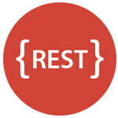

OpenML offers a range of APIs to download and upload OpenML datasets, tasks, run algorithms on them, and share the results.

##  REST  
The REST API allows you to talk directly to the OpenML server from any programming environment.

* [REST Tutorial](REST-tutorial)
* [REST API Reference](REST-API)

##  Python
Download datasets into Python scripts, build models using Python machine learning libraries (e.g., <i>scikit-learn</i>), and share the results online, all in a few lines of code.

* [Python Tutorial](Python-guide)
* [Python API Reference](Python-API)
* [Example Jupyter notebook](https://github.com/openml/openml-python/blob/master/examples/OpenML_Tutorial.ipynb)
* [Cheatsheet](https://github.com/openml/openml-python/blob/cheatsheet/examples/OpenML_Cheat_Sheet.pdf)
* [Online Demo](https://everware.ysda.yandex.net/hub/oauth_login?repourl=https://github.com/openml/study_example_python)

##  R
Download datasets into R scripts, build models using R machine learning packages (e.g. <i>mlr</i>), and share the results online, again in a few lines of code.

* [R Tutorial](R-guide)
* [R API Reference](R-API)
* [Cheatsheet](https://github.com/openml/openml-r/blob/master/vignettes/openml-cheatsheet.pdf)

##  Java
If you are building machine learning systems in Java, there is also an API for that.

* [Java Tutorial](Java-guide)
* [Java API Reference](https://openml.github.io/java/)

##  .NET (C#)
The .NET library is under development, but already contains most of the functions available.

* [.NET Tutorial](NET-API)
* [GitHub repo](https://github.com/openml/openml-dotnet)

## Easy authentication
In the interest of open science, we allow you to freely download all public resources, also through the APIs (rate limits apply when necessary).
Uploading and sharing new datasets, tasks, flows and runs (or accessing any shared/private resources) is also very easy, and requires only the API key that you can find <a href="https://www.openml.org/u#!api" target="_blank">in your profile</a> (after logging in).

If you use any of the language-specific APIs, you only need to store this key in a config file and forget about it. For authenticating to the REST API, you can send your api key using Basic Auth, or by adding <code>?api_key='your key'</code> to your calls. If you are logged into OpenML.org, this will be done automatically.
