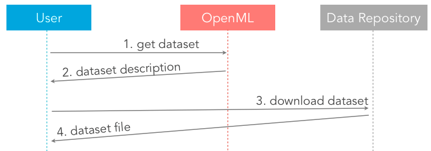
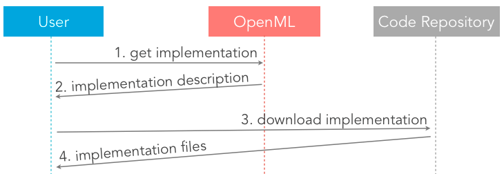
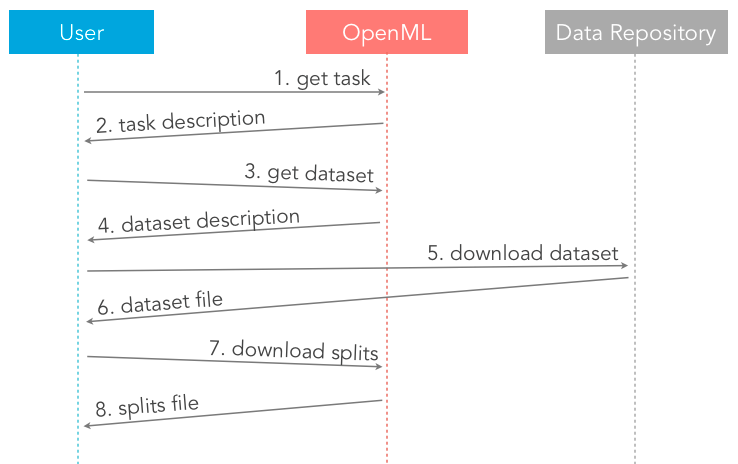

# REST tutorial

OpenML offers a RESTful Web API, with predictive URLs, for uploading and downloading machine learning resources. Try the <a href="https://www.openml.org/api_docs" target="_blank">API Documentation</a> to see examples of all calls, and test them right in your browser.

## Getting started

* REST services can be called using simple HTTP GET or POST actions.
* The REST Endpoint URL is <code class="http">https://www.openml.org/api/v1/</code>
* The default endpoint returns data in XML. If you prefer JSON, use the endpoint <code class="http">https://www.openml.org/api/v1/json/</code>. Note that, to upload content, you still need to use XML (at least for now).

## Testing
For continuous integration and testing purposes, we have a test server offering the same API, but which does not affect the production server.

* The test server REST Endpoint URL is <code class="http">https://test.openml.org/api/v1/</code>

## Error messages
Error messages will look like this:

```xml
<oml:error xmlns:oml="http://openml.org/error">
<oml:code>100</oml:code>
<oml:message>Please invoke legal function</oml:message>
<oml:additional_information>Additional information, not always available.</oml:additional_information>
</oml:error>
```

All error messages are listed in the API documentation. E.g. try to get a non-existing dataset:

* in XML: <a href="https://www.openml.org/api_new/v1/data/99999" target="_blank">https://www.openml.org/api_new/v1/data/99999</a>
* in JSON: <a href="https://www.openml.org/api_new/v1/json/data/99999" target="_blank">https://www.openml.org/api_new/v1/json/data/99999</a>

## Examples
You need to be logged in for these examples to work.

### Download a dataset


* User asks for a dataset using the <a href="https://www.openml.org/api_docs/#!/data/get_data_id">/data/{id}</a> service. The <code>dataset id</code> is typically part of a task, or can be found on OpenML.org.
* OpenML returns a description of the dataset as an XML file (or JSON). <a href="https://www.openml.org/api_new/v1/data/1" type="button" class="btn btn-primary btn-xs" target="_blank">Try it now</a>
* The dataset description contains the URL where the dataset can be downloaded. The user calls that URL to download the dataset.
* The dataset is returned by the server hosting the dataset. This can be OpenML, but also any other data repository. <a href="http://www.openml.org/data/download/1/dataset_1_anneal.arff" type="button" class="btn btn-primary btn-xs" target="_blank">Try it now</a>

### Download a flow


* User asks for a flow using the <a href="https://www.openml.org/api_docs/#!/flow/get_flow_id">/flow/{id}</a> service and a <code>flow id</code>. The <code>flow id</code> can be found on OpenML.org.
* OpenML returns a description of the flow as an XML file (or JSON). <a href="https://www.openml.org/api/v1/flow/65" type="button" class="btn btn-primary btn-xs" target="_blank">Try it now</a>
* The flow description contains the URL where the flow can be downloaded (e.g. GitHub), either as source, binary or both, as well as additional information on history, dependencies and licence. The user calls the right URL to download it.
* The flow is returned by the server hosting it. This can be OpenML, but also any other code repository. <a href="http://sourceforge.net/projects/weka/files/weka-3-4/3.4.8/weka-3-4-8a.zip/download" type="button" class="btn btn-primary btn-xs" target="_blank">Try it now</a>

### Download a task


* User asks for a task using the <a href="https://www.openml.org/api_docs/#!/task/get_task_id">/task/{id}</a> service and a <code>task id</code>. The <code>task id</code> is typically returned when searching for tasks.
* OpenML returns a description of the task as an XML file (or JSON). <a href="https://www.openml.org/api/v1/task/1" type="button" class="btn btn-primary btn-xs" target="_blank">Try it now</a>
* The task description contains the <code>dataset id</code>(s) of the datasets involved in this task. The user asks for the dataset using the <a href="https://www.openml.org/api_docs/#!/data/get_data_id">/data/{id}</a> service and the <code>dataset id</code>.
* OpenML returns a description of the dataset as an XML file (or JSON). <a href="https://www.openml.org/api/v1/data/61" type="button" class="btn btn-primary btn-xs" target="_blank">Try it now</a>
* The dataset description contains the URL where the dataset can be downloaded. The user calls that URL to download the dataset.
* The dataset is returned by the server hosting it. This can be OpenML, but also any other data repository. <a href="https://www.openml.org/api/v1/data/61" type="button" class="btn btn-primary btn-xs" target="_blank">Try it now</a>
* The task description may also contain links to other resources, such as the train-test splits to be used in cross-validation. The user calls that URL to download the train-test splits.
* The train-test splits are returned by OpenML. <a href="http://www.openml.org/api_splits/get/1/Task_1_splits.arff" type="button" class="btn btn-primary btn-xs" target="_blank">Try it now</a>
