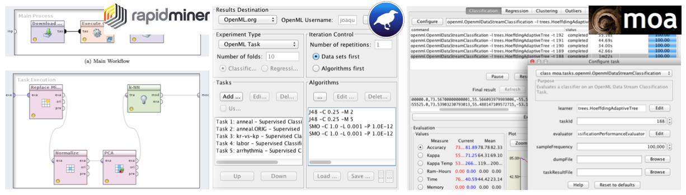

<link rel="stylesheet" href="https://maxcdn.bootstrapcdn.com/font-awesome/4.6.1/css/font-awesome.min.css">

<h1>An open, collaborative, <i>frictionless</i>, automated machine learning environment.</h1>

<i class="fa fa-globe fa-fw fa-lg"></i> <a href="https://www.openml.org/d" target="_blank">Data sets</a> automatically analyzed, annotated, and organized online

<i class="fa fa-cogs fa-fw fa-lg"></i> <a href="https://www.openml.org/f" target="_blank">Machine learning pipelines</a> automatically shared from many libraries.

<i class="fa fa-code fa-fw fa-lg"></i> <a href="APIs">Extensive APIs</a> to integrate OpenML into your own tools and scripts

<i class="fa fa-flask fa-fw fa-lg"></i> <a href="https://www.openml.org/r" target="_blank">Reproducible results</a> (e.g. models, evaluations) for easy comparison and reuse

<i class="fa fa-users fa-fw fa-lg"></i> Collaborate in real time, right from your existing tools

<i class="fa fa-graduation-cap fa-fw fa-lg"></i> Make your work more visible, reusable, and easily citable

<i class="fa fa-bolt fa-fw fa-lg"></i> Open source tools to automate experimentation and model building

## Concepts  
OpenML operates on a number of core concepts which are important to understand:  

**:fa-database: Datasets**  
Datasets are pretty straight-forward. They simply consist of a number of rows, also called _instances_, usually in tabular form.  
_Example: The <a href="https://www.openml.org/d/61" target="_blank">iris dataset</a>_

**:fa-trophy: Tasks**  
A task consists of a dataset, together with a machine learning task to perform, such as classification or clustering and an evaluation method. For
supervised tasks, this also specifies the target column in the data.  
_Example: <a href="https://www.openml.org/t/59" target="_blank">Classifying different iris species</a> from other attributes and evaluate using 10-fold cross-validation._

**:fa-cogs: Flows**  
A flow identifies a particular machine learning algorithm from a particular library or framework such as Weka, mlr or scikit-learn.  
_Example: <a href="https://www.openml.org/f/65" target="_blank">WEKA's RandomForest</a>_

**:fa-star: Runs**  
A run is a particular flow, that is algorithm, with a particular parameter setting, applied to a particular task.  
_Example: <a href="https://www.openml.org/r/6466" target="_blank">Classifying irises with WEKA's RandomForest</a>_

## Data
You can upload and download datasets through the <a href="https://www.openml.org/new/data" target="_blank">website</a>, or <a href="../API-index">API</a>. Data hosted
elsewhere can be referenced by URL.

Data consists of columns, also known as features or covariates, each of
which is either numeric, nominal or a string, and has a unique name. A column
can also contain any number of missing values.

Most datasets have a "default target attribute" which denotes the column that
is usually the target, also known as dependent variable, in supervised learning tasks. The default
target column is denoted by "(target)" in the web interface. Not all datasets
have such a column, though, and a supervised task can pick any column as the
target (as long as it is of the appropriate type).

Example: The default target variable for the <a
href="https://www.openml.org/d/554" target="_blank">MNIST</a> data is to predict the class from
pixel values, OpenML also allows you to create a task that tries to predict the
value of pixel257 given all the other pixel values and the class column. As such,
the class is also considered a feature in OpenML terminology.

OpenML automatically analyzes the data, checks for problems, visualizes it,
and computes <a href="https://www.openml.org/search?q=+measure_type%3Adata_quality&type=measure" target="_blank">data
characteristics</a>, also called data qualities (including simple ones like number of features, but also
more complex statistics like kurtosis or the AUC of a decision tree of depth 3).
These data qualities can be useful to find and compare datasets.

Every dataset gets a dedicated page with all known information (check out
<a href="https://www.openml.org/d/62" target="_blank">zoo</a>), including a wiki, visualizations, statistics, user
discussions, and the <i>tasks</i> in which it is used.

!!! info
    OpenML currently only supports uploading of ARFF files. We aim to extend this in the near future, and allow conversions between the main data types.

### Dataset ID and versions
A dataset can be uniquely identified by its dataset ID, which you can find
in the URL of the dataset page, such as 62 for <a href="https://www.openml.org/d/62" target="_blank">zoo</a>. Each
dataset also has a name, but several dataset can have the same name. When several datasets
have the same name, they are called "versions" of the same dataset (although
that is not necessarily true). The version number is assigned according to the order
of upload. Different versions of a dataset can be accessed through the drop
down menu at the top right of the dataset page.

### Dataset status
Each dataset has a status, which can be "active", "deactivated" or
"in_preparation". When you upload a dataset, it will be marked "in_preparation"
until it is approved by a site administrator.  Once it is approved, the dataset
will become "active". If a severe issue has been found with a dataset, it can
become "deactivated". By default, the search will only display datasets that are
"active", but you can access and download datasets with any status.

### Ignored features
Features in datasets can be tagged as "ignored" or "row id". Those features will not be
considered by programming interfaces, and excluded from any tasks.

## Tasks
Tasks describe what to do with the data. OpenML covers several <a
href="https://www.openml.org/search?type=task_type" target="_blank">task types</a>, such as classification and
clustering. You can <a href="https://www.openml.org/new/task" target="_blank">create tasks</a>
online.

Tasks are little containers including the data and other information such as
train/test splits, and define what needs to be returned.

Tasks are machine-readable so that machine learning environments know what
to do, and you can focus on finding the best algorithm. You can run algorithms
on your own machine(s) and upload the results. OpenML evaluates and organizes
all solutions online.

Tasks are <i>real-time, collaborative</i> data mining challenges (e.g. see
<a href="https://www.openml.org/t/145677#!people" target="_blank">this one</a>): you can study, discuss and learn from
all submissions (code has to be shared), while OpenML keeps track of who was
first.

More concretely, tasks specify the dataset, the kind of machine learning
task (i.e. regression), the target attribute (i.e. which column in the dataset
should be predicted), the number of splits for cross-validated evaluation and
the exact dataset splits, as well as an optional evaluation metric (i.e. mean
squared error). Given this specification, a task can be solved using any of the
integrated machine learning tools, like Weka, mlr and scikit-learn.

!!! note
    You can also supply hidden test sets for the evaluation of solutions. Novel ways of ranking solutions will be added in the near future.

## Flows

Flows are algorithms, workflows, or scripts solving tasks. You can upload
them through the <a href="https://www.openml.org/new/flow" target="_blank">website</a>, or [APIs](APIs).
Code hosted elsewhere (e.g., GitHub) can be
referenced by URL, though typically they are generated automatically by machine learning environments.

Flows contain all the information necessary to apply a particular workflow
or algorithm to a new task. Usually a flow is specific to a task-type, i.e.
you can not run a classification model on a clustering task.

Every flow gets a dedicated page with all known information (check out <a
href="https://www.openml.org/f/65" target="_blank">WEKA's RandomForest</a>), including a wiki, hyperparameters,
evaluations on all tasks, and user discussions.

!!! note
    Each flow specifies requirements and dependencies, and you need to install these locally to execute
    a flow on a specific task. We aim to add support for VMs so that flows can be easily (re)run in any environment.

## Runs

Runs are applications of flows to a specific task. They are typically
submitted automatically by machine learning
environments (through the OpenML [APIs](APIs)), with the goal of creating a
reproducible experiment (though exactly reproducing experiments across machines
might not be possible because of changes in numeric libraries and operating
systems).

OpenML organizes all runs online, linked to the underlying data, flows,
parameter settings, people, and other details. OpenML also independently
evaluates the results contained in the run given the provided predictions.

You can search and compare everyone's runs online, download all results into
your favorite machine learning environment, and relate evaluations to known
properties of the data and algorithms.

OpenML stores and analyzes results in fine detail, up to the level of
individual instances.

## Authentication
You can download and inspect all datasets, tasks, flows and runs through the
website or the API without creating an account. However, if you want to upload
datasets or experiments, you need to <a href="https://www.openml.org/register" target="_blank">create an account</a>
or sign in and <a href="https://www.openml.org/#api" target="_blank">create an API key</a>.
This key can then be used with any of the [OpenML APIs](APIs).

## Integrations
OpenML is deeply integrated in several popular machine learning environments. Given a task, these integrations will
automatically download the data into the environments, allow you to run any
algorithm/flow, and automatically upload all runs.

## Programming APIs
If you want to integrate OpenML into your own tools, we offer several [Language-specific APIs](APIs), so you can easily interact with
OpenML to list, download and upload datasets, tasks, flows and runs.

With these APIs you can download a task, run an algorithm, and upload the
results in just a few lines of code.

OpenML also offers a [REST API](APIs) which allows you to talk to OpenML directly.

## Tags
Datasets, tasks, runs and flows can be assigned tags, either via the web
interface or the API. These tags can be used to search and annotated datasets.
For example the tag <a
href="https://www.openml.org/search?q=tags.tag%3AOpenML100&type=task" target="_blank">OpenML100</a> refers to
benchmark machine learning algorithms used as a benchmark suite. Anyone can add
or remove tags on any entity.

## Studies (under construction)
You can combine datasets, flows and runs into studies, to collaborate with others online, or simply keep a log of your work.

Each project gets its own page, which can be linked to publications so that others can find all the details online.

## Circles (under construction)
You can create circles of trusted researchers in which data can be shared that is not yet ready for publication.

## Jobs (under construction)
OpenML can help you run large experiments. A job is a small container defining a specific flow, with specific parameters settings, to run on a specific tasks. You can generate batches of these jobs online, and you can run a helper tool on your machines/clouds/clusters that downloads these jobs (including all data), executes them, and uploads the results.
