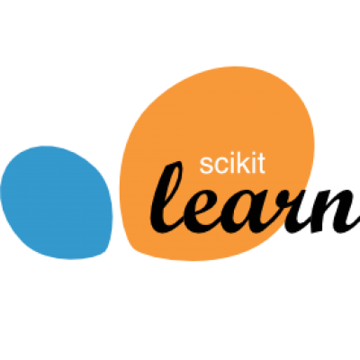

  <h1>Integrations</h1>

OpenML is readily integrated into a large and growing number of machine learning libraries and environments, so you can easily download and upload OpenML datasets, train models, and share the results.
If you want to integrate your own machine learning tool, see the available <a href="guide/api">APIs</a>, or join us in one of our hackathons!

 
<ul class="apilist"><li>

Most <a target="_blank" href="http://scikit-learn.org/">scikit-learn</a> machine learning algorithms, pipelines, and optimization procedures (e.g. RandomSearchCV) are readily supported through the Python API. Also any algorithm that can be wrapped as an scikit-learn estimator (e.g. xgboost) is supported. 
<a target="_blank" href="https://openml.github.io/openml-python" class="btn btn-raised btn-info">Documentation</a>
<a target="_blank" href="https://github.com/openml/openml-python/blob/master/examples/OpenML_Tutorial.ipynb" class="btn btn-raised btn-info">Jupyter Notebook</a>
<a target="_blank" class="btn btn-raised btn-info" href="https://everware.rep.school.yandex.net/hub/oauth_login?repourl=https://github.com/openml/study_example_python&OPENMLKEY=<?php echo (isset($this->api_key) ? $this->api_key : '');?>">Online demo</a>

</li><li>

Any R package included in <a target="_blank" href="https://github.com/mlr-org/mlr">mlr</a>, as well as preprocessing and benchmarking wrappers, are readily supported through the R API. 
<a target="_blank" href="https://openml.github.io/openml-r" class="btn btn-raised btn-info">Documentation</a>
<a target="_blank" href="http://openml.github.io/openml-r/vignettes/OpenML.html" class="btn btn-raised btn-info">Tutorial</a>

</li><li>

OpenML has a WEKA plugin that can be installed though the WEKA Package manager. It offers its own GUI to easily experiment with any WEKA algorithm. 
<a href="https://github.com/openml/OpenML/wiki/Weka" class="btn btn-raised btn-info">Weka guide</a>
<a href="https://github.com/openml/openml-weka" class="btn btn-raised btn-info">Documentation on GitHub</a>

</li><li>

OpenML can also be used with the Massive Online Analysis library, to run experiments with data stream classifiers. 
  <a href="https://github.com/openml/OpenML/wiki/MOA" class="btn btn-raised btn-info">MOA guide</a>
  <a href="https://www.openml.org/downloads/openmlmoa.beta.jar" class="btn btn-raised btn-info">Standalone version</a>
  <a href="https://github.com/openml/java/tree/master/moa" class="btn btn-raised btn-info">Documentation on GitHub</a>

</li><li>

You can design OpenML workflows in RapidMiner (community version) to directly interact with OpenML. The RapidMiner plugin is currently <a href="https://github.com/openml/rapidminer"> under active development</a>.
 
<a href="downloads/RM-OpenmlConnector-1.0.0-all.jar" class="btn btn-raised btn-info">Alpha Release</a>

</li></ul>

<h2>Authentication</h2>

In all integrations, you can easily authenticate by setting your API key once (and then forget about it). See the tool-specific instructions above on how to do this. You can find your API key <a href="u#!api">in your profile</a> (after logging in).

